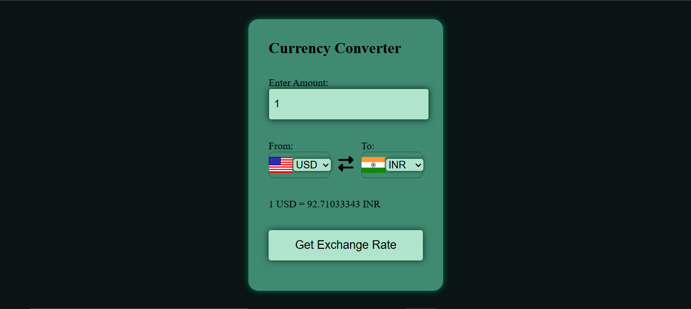

# 💱 Currency Converter Web App

A simple and modern currency converter built using **HTML, CSS, and JavaScript**.

## 🚀 Features

- Convert any currency to another
- Real-time exchange rates (API based)
- Country flags update dynamically
- Clean and responsive UI

## 🛠️ Tech Stack

- HTML
- CSS
- JavaScript
- Currency API

## 📸 Preview

## ⚡ How to Run

1. Download the project
2. Open `index.html` in browser

## 🌐 Live Demo
👉[Click here to use the app](https://anshi-g.github.io/Currency-Converter/)

## 🙋‍♀️ Author

Anshima Gupta (Anshi-G)
